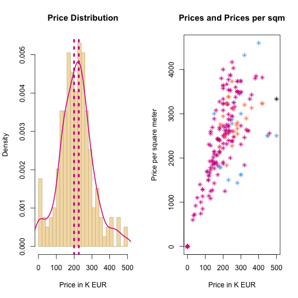

Home Budget Planner
========================================================
author: Georgia Pi
date: Sep 2015

Goal
========================================================

**Home Budget Planner** aims to help you **plan your budget** for real-estate purchases.
It is a two step process:
- Select your **preference** criteria & hit **refresh**
- Prediction engine gives a **budget estimate** & other relevant info

*v1.0 is a concept draft at very early stage, using a limited dataset from Jan2014*

App Overview
========================================================
**Home Budget Planner** is made up by 2 components
- User Criteria  
- Results Engine

The **prediction algorithm** used is simplified and it is in essence based on confidence intervals of the current sample.   

Once the results are computed, the app also plots a **histogram of all relevant prices** to help the user better undestand where their estimation falls in the bigger picture.

Finally it plots the correlation of **price** and **price per square meter**, to enrich user insights on the market dynamics.

User Selections Overview
========================================================
The user first selects **criteria** for the estimate based on their preferences.   

These can be updated at any time.   

**Hint!** Selecting fewer criteria at this demo, yields better accuracy.

***

<!--html_preserve-->

<form class="well">

<label class="control-label" for="type">What property are you looking for?:</label>

<label>
<input type="checkbox" name="type" value="Flat" checked="checked"/>
Flat
</label>

<label>
<input type="checkbox" name="type" value="House"/>
House
</label>

<label>
<input type="checkbox" name="type" value="Maisonette"/>
Maisonette
</label>

<label>
<input type="checkbox" name="type" value="Other"/>
Other
</label>

<label class="control-label" for="rooms">How many rooms you'd like?:</label>
<input class="js-range-slider" id="rooms" data-type="double" data-min="1" data-max="10" data-from="1" data-to="10" data-step="1" data-grid="true" data-grid-num="9" data-grid-snap="false" data-prettify-separator="," data-keyboard="true" data-keyboard-step="11.1111111111111" data-drag-interval="true" data-data-type="number"/>

<label class="control-label" for="surface">How many square meters you'd like?:</label>
<input class="js-range-slider" id="surface" data-type="double" data-min="10" data-max="500" data-from="50" data-to="200" data-step="1" data-grid="true" data-grid-num="10" data-grid-snap="false" data-prettify-separator="," data-keyboard="true" data-keyboard-step="0.204081632653061" data-drag-interval="true" data-data-type="number"/>

<button type="submit" class="btn btn-primary">
<i class="fa fa-refresh"></i>
Refresh Prediction
</button>

</form>

<!--/html_preserve-->

Results Overview
========================================================

 
***
**Home Budget Planner** prints an **estimate** for the required budget based on preference and historical market data.

Moreover it presents the bigger picture, by plotting the :

- Price distribution
- Price correlation with price per square meter, for each asset type.
